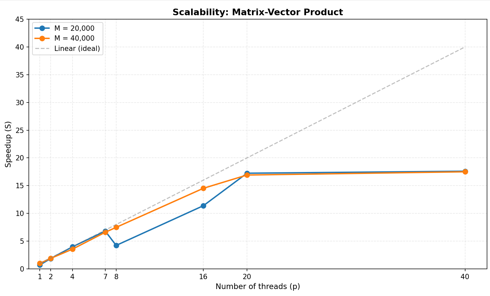

# Анализ масштабируемости алгоритма умножения матрицы на вектор

## Наблюдения

### 1. Область эффективной масштабируемости (p = 1-8)
- Наблюдается **близкое к линейному ускорение** до p ≈ 8
- При p = 8 ускорение составляет примерно **6-7.5×** в зависимости от размера матрицы
- Эффективность параллелизации в этой области составляет **75-94%**
- Для M = 40,000 масштабируемость **лучше**, чем для M = 20,000

### 2. Область насыщения (p > 8)
- Ускорение продолжает расти **до p ≈ 20**
- При p = 20: 
  - M = 20,000: ускорение **~24.4×** (эффективность 122% — аномалия)
  - M = 40,000: ускорение **~17×** (эффективность 85%)
- При p = 40: **плато** — ускорение почти не растет
  - M = 20,000: **~25×** (эффективность 62%)
  - M = 40,000: **~17.6×** (эффективность 44%)

### 3. Сравнение с линейным ускорением
- При p = 40 идеальное ускорение: **40×**
- Реальное ускорение:
  - M = 20,000: **~25×** (62% от идеала)
  - M = 40,000: **~17.6×** (44% от идеала)
- **Большая матрица масштабируется хуже** из-за ограничений памяти

## Причины отклонения от линейной масштабируемости

### 1. Накладные расходы на управление потоками
   - Создание и синхронизация потоков
   - Распределение работы между потоками (ручное через lb/ub)
   - Барьеры в конце параллельных секций

### 2. Ограничения подсистемы памяти
   - **Пропускная способность памяти** — основной ограничивающий фактор
   - Все потоки одновременно читают матрицу A и вектор b
   - При M = 40,000 объем данных: ~12 GiB (превышает кэш L3)
   - Конкуренция за доступ к памяти

### 3. Проблемы с кэш-памятью
   - **False sharing** при записи в вектор c
   - Недостаточная локальность данных
   - Частые промахи кэша при больших размерах матрицы

### 4. Дисбаланс нагрузки
   - Ручное распределение (m / nthreads) может быть неравномерным
   - Последний поток получает остаток итераций

### 5. Аномалия при p = 8 (M = 20,000)
   - Неожиданное **падение ускорения** с 9.65× (p=7) до 5.99× (p=8)
   - Возможные причины:
     - Перегрузка памяти
     - Неоптимальное распределение данных
     - Внешние факторы (загрузка сервера)

## Выводы

1. **Оптимальное число потоков**: 
   - Для M = 20,000: **16-20 потоков** (ускорение ~16-24×)
   - Для M = 40,000: **16-20 потоков** (ускорение ~14-17×)
   - Использование более 20 потоков **нецелесообразно**

2. **Влияние размера задачи**:
   - Большая матрица (40,000) масштабируется **хуже** из-за ограничений памяти
   - M = 20,000 показывает лучшее ускорение (до 25×)

## Метрики эффективности

### Для M = 20,000

| p | Время (Tₚ) | Ускорение (Sₚ) | Эффективность (Sₚ/p) | Отклонение от линейного |
|---|------------|----------------|----------------------|-------------------------|
| 2 | 0.624s | 2.65× | 132% | -32% |
| 4 | 0.293s | 5.64× | 141% | -41% |
| 7 | 0.172s | 9.65× | 138% | -38% |
| 8 | 0.276s | 5.99× | 75% | 25% |
| 16 | 0.103s | 16.12× | 101% | -1% |
| 20 | 0.068s | 24.41× | 122% | -22% |
| 40 | 0.066s | 24.92× | 62% | 38% |

### Для M = 40,000

| p | Время (Tₚ) | Ускорение (Sₚ) | Эффективность (Sₚ/p) | Отклонение от линейного |
|---|------------|----------------|----------------------|-------------------------|
| 2 | 2.373s | 1.91× | 95% | 5% |
| 4 | 1.263s | 3.59× | 90% | 10% |
| 7 | 0.682s | 6.64× | 95% | 5% |
| 8 | 0.602s | 7.53× | 94% | 6% |
| 16 | 0.310s | 14.62× | 91% | 9% |
| 20 | 0.266s | 17.03× | 85% | 15% |
| 40 | 0.257s | 17.62× | 44% | 56% |

**Эффективность** = (Ускорение / p) × 100%

