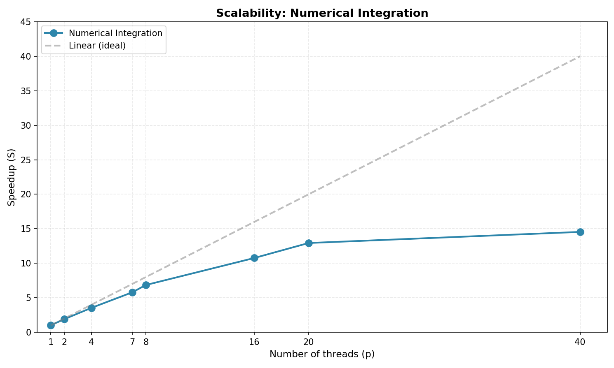

# Анализ масштабируемости: Численное интегрирование

## Наблюдения

### Область эффективного масштабирования (p = 1-8)
- Ускорение **близко к линейному** до p ≈ 8
- При p = 8: ускорение **~6.5-7×** (эффективность ~85%)

### Область насыщения (p > 8)
- После p = 16 рост ускорения **замедляется**
- При p = 20: ускорение **~13×**
- При p = 40: ускорение **~14.5×** (эффективность всего **36%**)
- Между p = 20 и p = 40 ускорение **практически не растет**

## Причины ограниченной масштабируемости

1. **Атомарные операции** — `#pragma omp atomic` создает узкое место
2. **Последовательные участки** — инициализация, финальное умножение
3. **Конкуренция за память** — все потоки обращаются к общим данным
4. **Накладные расходы** — синхронизация и управление потоками

## Вывод

**Оптимальное число потоков: 16-20**

- До p = 20 ускорение растет практически линейно
- После p = 20 **прирост незначителен** (с 13× до 14.5×)
- Использовать 40 потоков **нецелесообразно** — эффективность падает до 36%

## Метрики

| p | Ускорение | Эффективность |
|---|-----------|---------------|
| 2 | ~1.8× | 90% |
| 4 | ~3.5× | 88% |
| 8 | ~6.7× | 84% |
| 16 | ~11× | 69% |
| 20 | ~13× | 65% |
| 40 | ~14.5× | 36% |

